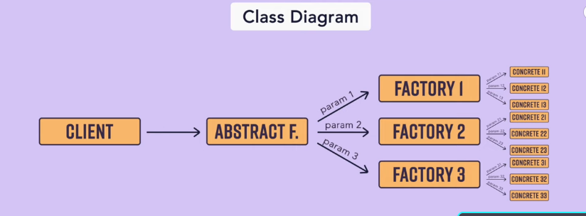

Class Diagram for factory 

client -> factory -> {concrete 1,  concrete 2, concrete 3}

Abstract factory Interface <--inherits-- Concrete Factory Interface <--Inherits--- Concrete Object Class 

client ->Abstract F. ->{param1 ->{factory1 -> {concrete 1,  concrete 2, concrete 3}, factory2 -> {concrete 1,  concrete 2, concrete 3}, factory 3 -> {concrete 1,  concrete 2, concrete 3}}, param2 ->{factory1 -> {concrete 1,  concrete 2, concrete 3}, factory2 -> {concrete 1,  concrete 2, concrete 3}, factory3 -> {concrete 1,  concrete 2, concrete 3}}, param3 ->{factory1 -> {concrete 1,  concrete 2, concrete 3}, factory2 -> {concrete 1,  concrete 2, concrete 3}, factory3 -> {concrete 1,  concrete 2, concrete 3}}}

Analogy
There is huge furniture factory with the collection of some small factory.  The client is going to place an order for chair or sofa or table ultimately the abstract factory will give the common interface such as like one can order a piece of furniture which can be chair, sofa or table , internally depending on what order has been placed whether its a chair or sofa or table this factory will send an order to its respective speciliz factory for that furniture to be manufactured and then returned to the client. ** SO this is the factory of factories **